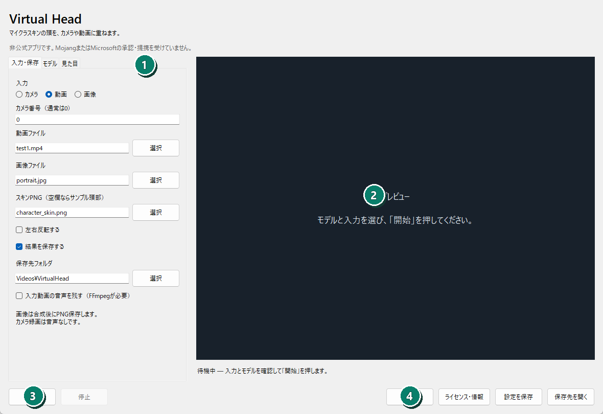
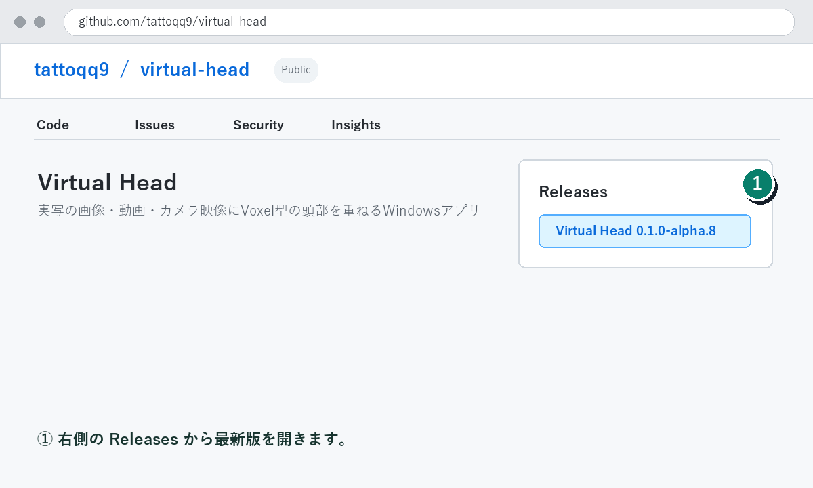
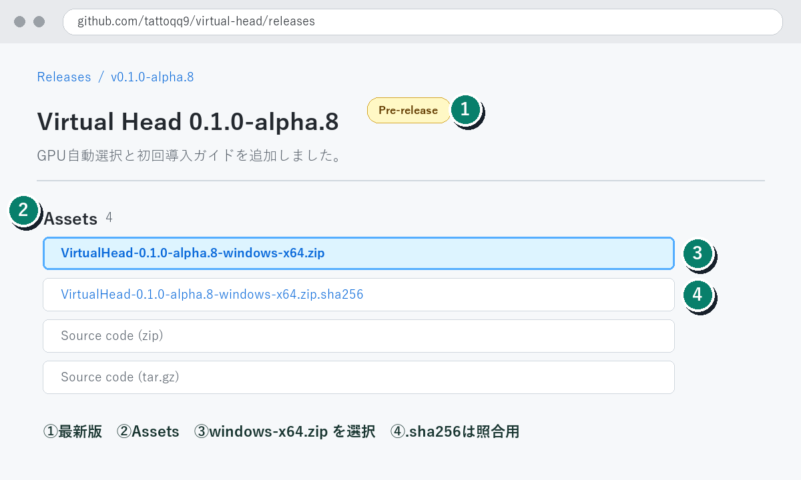
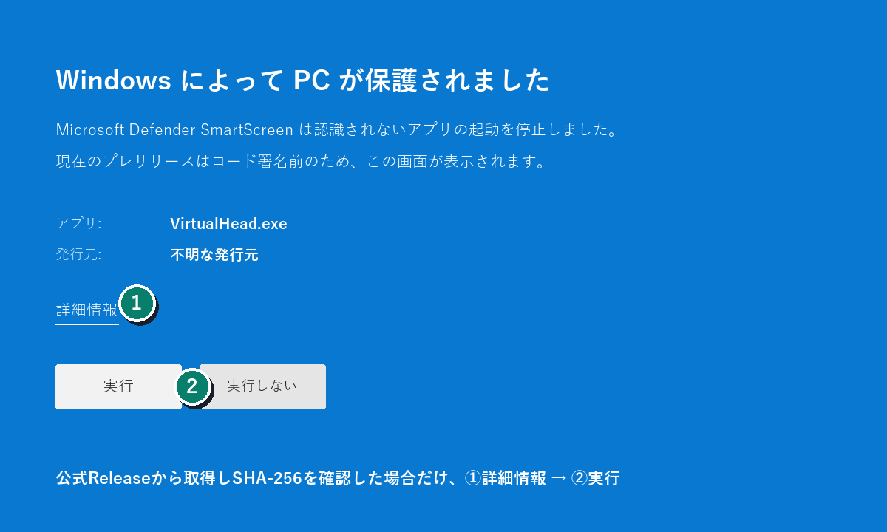
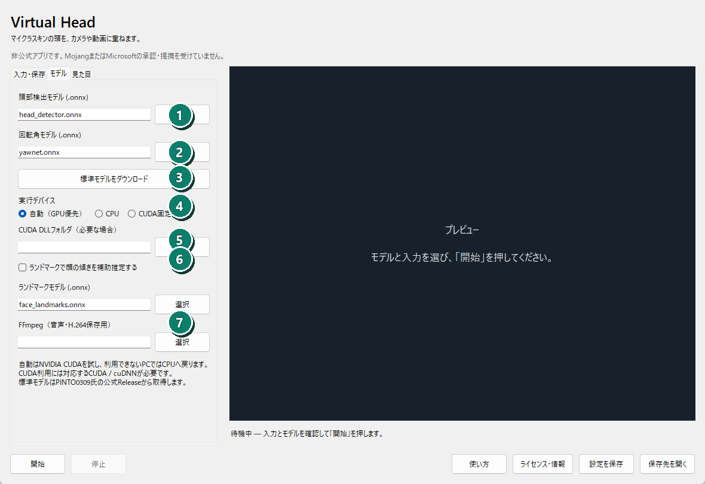
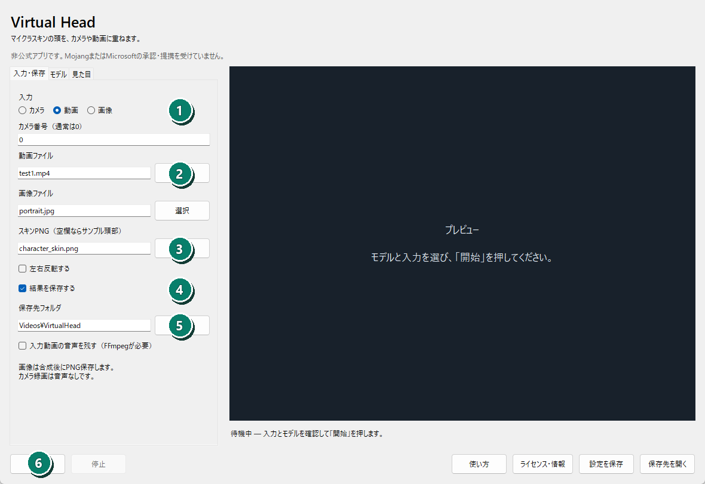
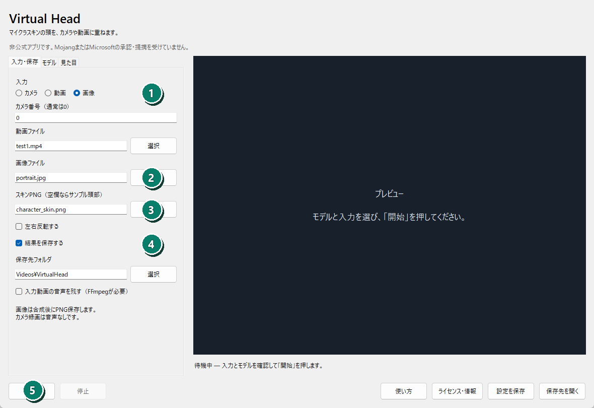
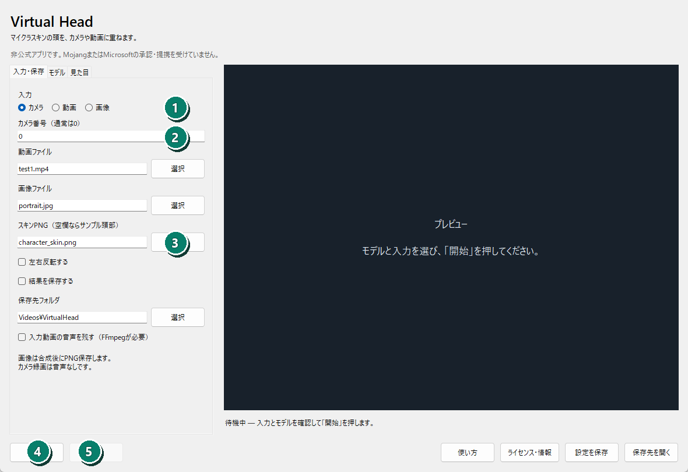
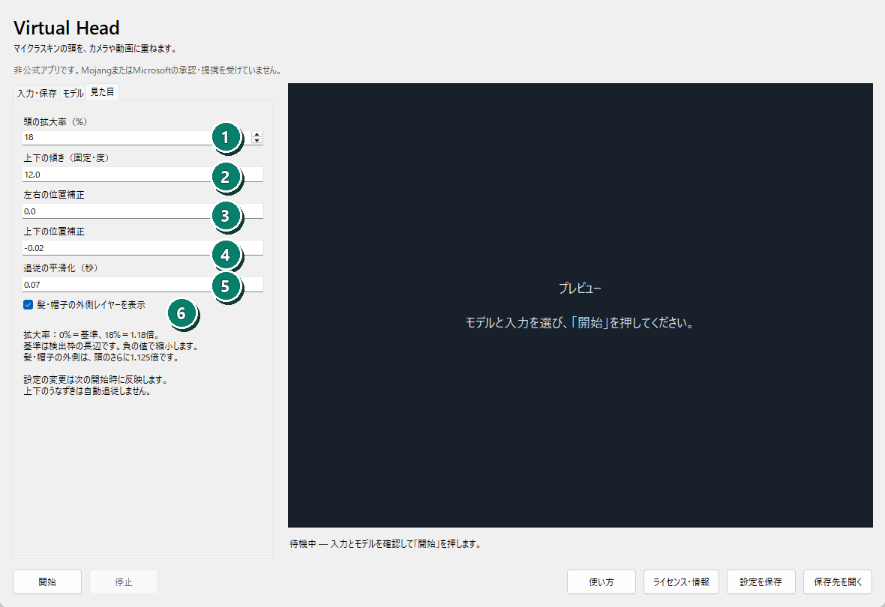

# Virtual Head

Virtual Headは、画像・動画・カメラの実写頭部へ、Minecraft互換SkinのVoxel頭部を重ねるWindowsアプリです。頭部の位置、大きさ、Yaw（左右の回転）をONNXモデルで推定し、体と背景を実写のまま残します。



> [!WARNING]
> 現在は未署名のプレリリースです。学習済みONNXモデルはZIPに含めず、利用者がアプリ内のボタンからPINTO0309氏の公式GitHub Releaseより取得します。商用利用を予定する場合は、先に[モデルの条件](MODEL_LICENSES.md)を確認してください。

## ダウンロード

1. [Virtual Headのリポジトリ](https://github.com/tattoqq9/virtual-head)を開き、右側の「Releases」から最新リリースへ進みます。
2. 「Assets」を開き、`VirtualHead-<version>-windows-x64.zip`をダウンロードします。
3. 同じ場所の`.zip.sha256`は改ざん確認用です。「Source code」のZIPはアプリではありません。
4. ZIPを右クリックして「すべて展開」し、展開先の`VirtualHead.exe`を起動します。`_internal`フォルダと分離しないでください。





Windows x64用です。Pythonのインストールは不要です。

## 初回起動

1. 「モデル」タブを開きます。
2. 「標準モデルをダウンロード」を押します。
3. 約80MBの頭部検出モデルとYawNetを公式配布元から取得し、容量とSHA-256を検証して自動設定します。
4. 入力とSkinを選び、「開始」を押します。

標準モデルの取得は利用者がボタンを押した場合だけ実行します。取得URL、容量、SHA-256は[MODEL_DOWNLOADS.json](MODEL_DOWNLOADS.json)に固定しています。

## SmartScreenの警告

現在のGitHub配布版はコード署名がないため、「WindowsによってPCが保護されました」「不明な発行元」と表示される場合があります。GitHubのこのリポジトリのReleaseから取得し、SHA-256が一致することを確認したファイルに限り、「詳細情報」から「実行」を選択してください。



PowerShellでの確認例です。表示された値をReleaseの`.sha256`と比較します。

```powershell
Get-FileHash .\VirtualHead-0.1.0-alpha.8-windows-x64.zip -Algorithm SHA256
```

警告の恒久対応と今後のMicrosoft Store配布については[コード署名方針](CODE_SIGNING.md)を参照してください。

## 主な機能

- PNG／JPEG／BMP／WebP画像への合成
- 動画への合成と、FFmpeg指定時のH.264・入力音声保存
- カメラのリアルタイムプレビューと録画
- Minecraft互換Skin PNGの頭部6面と髪・帽子レイヤー
- 頭の大きさ、位置、固定Pitch、追従平滑化の調整
- NVIDIA CUDAを優先し、利用できないPCではCPUへ自動切替
- 画像・動画・モデルの入力検査と既知モデルのSHA-256照合
- 映像処理はPC内で完結。アカウント、広告、遠隔測定なし

## GPUの自動利用

alpha.8から「自動（GPU優先）」が初期値です。NVIDIA CUDAを初期化できれば、頭部検出とYawNetの両方でGPUを使います。利用できなければ処理を止めずにCPUへ切り替えます。実際に選ばれたデバイスは画面の状態表示と`run.json`の`active_device`で確認できます。

CUDA実行にはNVIDIAドライバー、CUDA 12.x、cuDNN 9.xが必要です。大容量になるためCUDA/cuDNNはZIPへ同梱していません。導入後も自動検出されない場合は、「モデル」タブのCUDA DLLフォルダにランタイムDLLのある場所を指定します。対応条件は[ONNX Runtime CUDA公式説明](https://onnxruntime.ai/docs/execution-providers/CUDA-ExecutionProvider.html)を参照してください。AMD・Intel GPU向けDirectMLも検証しましたが、現在の頭部検出モデルに非対応の演算があるため、この版では使用しません。



## 使い方

アプリ画面下の「使い方」ボタンから、ダウンロード手順を含む10枚の画像ガイドを開けます。リポジトリ内の[USER_GUIDE.html](USER_GUIDE.html)も同じ内容です。

### 動画



「動画」を選択し、動画、Skin、保存先を指定して開始します。FFmpegを指定するとH.264へ変換し、入力音声を残せます。

### 画像



「画像」を選択して開始すると1枚だけ処理し、`overlay.png`、`tracking.jsonl`、`run.json`を保存します。

### カメラ



通常はカメラ番号`0`を使用します。カメラ録画に音声は入りません。

### 見た目



頭の拡大率の初期値は`18%`です。保存済み設定がある場合は保存値を優先します。

## プレリリースの制限

- Yawは自動追従しますが、Pitchは固定設定です。
- 手や物体が顔の前を横切る場合の前景復元には対応していません。
- カメラ録画は公称FPSを使うため、処理が追いつかないPCでは実時間とずれる場合があります。
- 仮想カメラ、VRM、MMD、FBXのOverlayはこのWindows配布版に含まれません。
- ONNXモデル、第三者Skin、単体FFmpeg、CUDA/cuDNNは同梱していません。

## プライバシーとセキュリティ

画像、動画、カメラ映像は利用者のPC内で処理されます。映像、診断情報、利用統計を外部送信しません。利用者が標準モデルの取得を選んだ場合だけ、GitHubへHTTPS接続します。詳しくは[PRIVACY.md](PRIVACY.md)と[SECURITY.md](SECURITY.md)を参照してください。

不具合は[GitHub Issues](https://github.com/tattoqq9/virtual-head/issues)へ報告できます。ログや`run.json`にはローカルのユーザー名やファイルパスが含まれる場合があるため、公開前に内容を確認してください。未修正の脆弱性は公開Issueではなく、[GitHubの非公開Security Advisory](https://github.com/tattoqq9/virtual-head/security/advisories/new)から報告してください。

## ライセンスと権利表示

Virtual Head本体は[MIT License](LICENSE)、Copyright © 2026 tattoです。この公開リポジトリはバイナリ配布と問題報告用で、開発ソースコードは含みません。

第三者コードとライブラリはそれぞれのライセンスに従います。[THIRD_PARTY_NOTICES.txt](THIRD_PARTY_NOTICES.txt)と配布ZIP内の`licenses`を確認してください。モデルと素材の条件は[MODEL_LICENSES.md](MODEL_LICENSES.md)にまとめています。

Virtual Headは公式Minecraft製品ではなく、MojangまたはMicrosoftの承認・提携を受けていません。Minecraftの名称は、利用者が用意する互換Skin PNG形式の説明として使用しています。公式素材は配布物に含みません。
